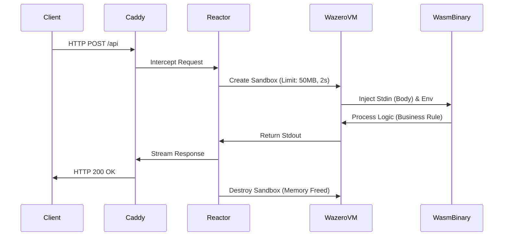

# ☢️ Caddy Reactor

> **In-Process Serverless Runtime for Caddy Web Server**  
> Run Go, Rust, and Zig code directly inside your HTTP request flow with WebAssembly.

[](https://pkg.go.dev/github.com/pauloappbr/caddy-wazero-reactor)
[]()
[](https://wazero.io)

---

## 🚀 Why?

Traditional Serverless (AWS Lambda) or Containerization (Docker) suffers from **Cold Starts** (latency to spin up) and high idle resource consumption.

**Caddy Reactor** brings the compute to the data:

- **Zero Infrastructure:** No Docker daemon, no Kubernetes, no sidecars.
- **Ultra-Low Latency:** Cold starts in **~1.3ms** (vs 2000ms+ for Docker).
- **Safety:** Each request runs in a strict, isolated WebAssembly sandbox.
- **Polyglot:** Write your handler in Go, Rust, Swift, Zig, or C++.

---

## ⚡ Benchmarks: Docker vs Reactor

We compared a standard **Docker** container (running as a daemon) against **Reactor** (spinning up a fresh sandbox per request).

| Metric | Docker Container (Alpine/Go) | Caddy Reactor (Wasm/Go) | The Verdict |
|--------|----------------------|---------------------|--------|
| **Artifact Size** | 20.6 MB (Image) | 3.0 MB (Binary) | 🏆 **Reactor (6.8x smaller)** |
| **Execution Model** | Persistent Daemon (consumes RAM while idle) | Ephemeral Sandbox (0 RAM while idle) | 🏆 **Reactor** |
| **Request Latency** | ~9ms (Warm State) | ~13ms (Cold Start State) | 🤝 **Tie** (Imperceptible difference) |
| **Cold Start** | ~1500ms (Container boot) | **<1ms** (Wazero init) | 🏆 **Reactor** |

> **Note:** Reactor achieves near-native performance (~4ms overhead) while providing complete isolation for every single request. Unlike Docker, if no requests are coming in, Reactor consumes **zero CPU/Memory** resources for the handler.

---

### 🧪 How to reproduce results

You can run this duel on your own machine using the provided `benchmark/` folder.

1. **Build Docker Image:**

   ```bash
   cd benchmark/docker && docker build -t benchmark-go . && cd ../..
   ```
2. **Build Wasm Binary:**

   ```bash
    cd benchmark/wasm && GOOS=wasip1 GOARCH=wasm go build -ldflags="-s -w" -o tax.wasm main.go && cd ../..
    ```
3. **Run the Duel:**

- Terminal 1 (Docker):

    ```bash
    docker run --rm -p 8081:8081 benchmark-go
    ```
- Terminal 2 (Reactor):

    ```bash
    ./caddy-reactor run --config Caddyfile.test --adapter caddyfile
    ```
- Terminal 3 (Client):

    ```bash
    time curl -s -X POST http://localhost:8080/api/bench -d '{"id":"1", "valor":100}'
    ```

## 🏗 Architecture

Unlike a reverse proxy that sends traffic to a backend service, **Reactor** executes the binary *inside* the Caddy process memory space.



---

## 🛠 Installation

You need to build Caddy with this plugin.


```bash
# Using xcaddy (Recommended)
xcaddy build \
    --with https://github.com/pauloappbr/caddy-wazero-reactor
```
Or manually with Go:
```bash
go get https://github.com/caddyserver/caddy/v2
go get https://github.com/pauloappbr/caddy-wazero-reactor
go build -o caddy ./cmd/caddy
```
--- 

### ⚙️ Configuration (Caddyfile)

```caddyfile
:8080 {
    handle /api/* {
        reactor ./functions/processor.wasm {
            timeout 2s
            memory_limit 128MB 

            env DB_HOST "localhost"
            env API_KEY {env.SECRET_KEY}
            
            args --verbose --mode=json
        }
    }
}
```

### 📝 How to write a Function

Your code just needs to read from Stdin (Request Body) and write to Stdout (Response).

## Golang Example
```go
package main

import (
    "io"
    "os"
)

func main() {
    // 1. Read Input (Body from Caddy)
    body, _ := io.ReadAll(os.Stdin)
    
    // 2. Process logic...
    host := os.Getenv("DB_HOST")
    
    // 3. Write Output (Response to Client)
    os.Stdout.WriteString("Processed by " + host + ": " + string(body))
}
```
## Compile to WASM:

```bash
GOOS=wasip1 GOARCH=wasm go build -o processor.wasm main.go
```

---

## 📝 License

This project is licensed under the Apache License, Version 2.0.  
See the [LICENSE](./LICENSE) file for more details.

